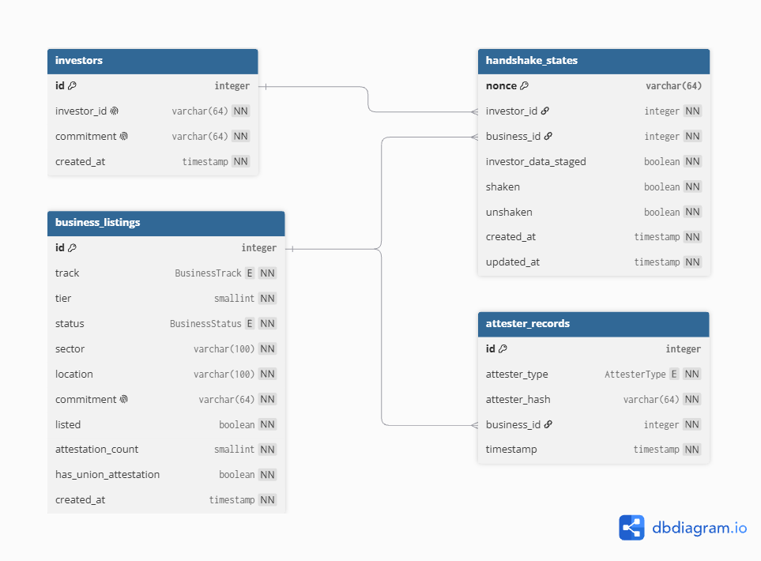

# BrowseMe

Privacy-preserving dApp built on the Midnight Network using Compact smart contracts.

## Overview

Most Nigerian small businesses operate informally — no CAC (Corporate Affairs Commission) registration, and no accessible way to prove legitimacy to outside capital. Every existing investment-discovery platform assumes formal registration as the price of entry, which structurally excludes the informal sector. And the businesses that *do* want to be discoverable have no way to signal credibility without fully doxxing sensitive data — revenue, exact address, ownership — to every visitor.

BrowseMe is a zero-knowledge business verification and investment-discovery protocol built to close that gap. It supports both formal (CAC-registered) and informal (community-attested) businesses through a single dual-track protocol, keeps all sensitive data off-chain by default, and lets investors discover and connect with businesses through a mutual, consent-gated handshake rather than a scraped contact list. This is a discovery and verification layer, not a payments rail — settlement and escrow are explicitly out of scope for v0.1.

## Why this design

**Why two tracks, not one.** Track A (CAC-registered) is the low-friction path — formal registration is treated as sufficient proof on its own, because the paperwork already did the vetting. Track B exists because most of the businesses this platform is *for* don't have that paperwork and never will. Instead, credibility is built from community standing: attestations from local authorities, religious organizations, unions, and education bodies substitute for the KYC infrastructure informal businesses can't access. This is the actual innovation the protocol is built around, not a secondary feature.

**Why the union attestation is required, not optional.** Of the four attester types, a Track B business cannot reach the listing threshold without at least one union attestation. Community and religious vouching alone can be socially cheap to obtain from a small circle; requiring a union attestation forces a different, harder-to-collude social graph into the mix as a baseline anti-Sybil measure, without needing a central registrar to vet anyone.

**Why count-threshold scoring, not type-weighted.** Whether union + education should outweigh two community attestations is flagged as unresolved. For the hackathon build we shipped the simpler count-based version — auditable in the time available, with the union-gate already doing the heavy lifting on trust. Type-weighting is a known, named follow-on, not an oversight.

**Why the disclosure surface is only four fields (tier, status, sector, location).** This is the core privacy property, not an incidental detail — every additional public field is permanent ledger bloat *and* a permanent privacy leak. An investor can filter and browse without ever seeing revenue, exact address, or business identity until both sides opt in. In the current build, `status` is always written as `Open` at registration — the spec calls for a business-controlled toggle between `Investing`/`Open`, but there's no circuit to flip it yet; treat that as reserved, not live.

**Why unshake is unilateral.** Investor data is staged before a business ever responds to a handshake — so if a business goes silent, the investor cannot be left holding data in limbo indefinitely, and nobody should be able to force the other party to keep holding their data at all. Either side can walk away and force-destroy the exchange at any time, without needing the other party's cooperation. That's what makes the privacy guarantee enforceable even against an unresponsive counterparty, not just a well-behaved one.

## How it works

**1. Investor registration** — an investor registers a commitment (a hash of their private identity/tax data), not the data itself.

**2. Business registration — two tracks:**
- **Track A** (CAC-registered SME): registration alone is sufficient. Sector and location are disclosed publicly, and the listing goes live immediately at a baseline tier.
- **Track B** (community-attested informal business): tier and visibility are withheld at registration. The business only becomes publicly listed once it clears a trust threshold (see below).

**3. Attestations (Track B only)** — attesters (community/local authority, religious authority, union authority, or local education authority) submit attestation commitments vouching for the business. Duplicate attestations from the same attester/business pair are rejected via nullifiers. Once a business has **2–4 attestations including at least one from a union**, its tier is computed (T3 to T1) and the listing goes live — all without revealing who attested or what was said.

**4. Handshake protocol** — a registered investor initiates a handshake with a listed business, staking a single-use nonce and staging (not yet delivering) their private data. Only the business owner can "shake" to confirm, at which point both parties' data is delivered symmetrically — the business never sees investor data unless it reciprocates. Either party can "unshake" unilaterally, at any time, before or after a shake, which destroys any staged or exchanged data tied to that handshake.

Full technical design, including the security rationale and open questions, lives in [`docs/spec.md`](./docs/spec.md).

## Known deltas from spec

This README describes the current contract (`contracts/main.compact`), not the full design spec ([`docs/spec.md`](./docs/spec.md)) — a few things are still open, simplified, or ahead of it:

**Behind or different from spec:**
- **Status is not yet toggleable.** Every business is written as `Status.OPEN` at registration; there's no circuit for a business to switch to `Investing`. Reserved field, not live functionality.
- **Private form fields (Tax ID, Estimated Annual Revenue, etc.) are never distinct on-chain values.** The contract only ever sees an opaque `Bytes<32>` commitment for the full private form — that's intentional (it's the whole privacy property), but it means those field names from the data model don't appear anywhere in the contract itself.
- **Track A business IDs are auto-assigned**, not derived from Tax ID as the spec's data model implies.
- **Track A's tier is a fixed baseline (`2`)**, not a computed value — only Track B's tier is actually derived from attestation strength.
- **Tier scoring is count-threshold, not type-weighted** — a deliberate hackathon-scope tradeoff, not an oversight (see "Why this design" above).
- **No `AttesterRecord` struct exists.** Spec §8.2 defines one (`attesterType`, `attesterHash`, `businessId`, `timestamp`). The contract skips per-attester records entirely and tracks only an `attestationCounts` number, a `hasUnionAttestation` flag, and a nullifier set — structurally different from the spec, though arguably more minimal.
- **`BusinessListing` has extra fields (`track`, `listed`) not in the spec's struct**, and tier legitimately ranges `0–3` (0 = pending) rather than the spec's `1–3`.
- **Repo layout doesn't match §11.1's proposal.** The spec proposes separate `business.compact` / `investor.compact` / `attestation.compact` / `handshake.compact` files plus `frontend/` and `indexer/` directories. The current repo has a single `main.compact` and no frontend or indexer yet.
- **No timestamp or handshake-expiry logic (§9.1, §10.3).** Both are flagged in the spec as considerations, not requirements for v0.1, and remain unimplemented.

**Ahead of spec:**
- **Attestation nullifiers are implemented** (`attestationNullifiers`), resolving §12's open question on nullifier design before it was asked.
- **The union-attestation requirement is enforced at the circuit level** (`hasUnionAttestation`), not left as a UI-only checkbox — exactly what §9.3 called for as a hard requirement.
- **`businessOwners` and `nextBusinessId` ledgers** were added beyond the spec's §8.1 list to support owner-only `shake` authorization and auto-incrementing IDs — both necessary additions the spec didn't fully specify.

## Running the demo

```bash
yarn test
```

Runs the contract's test suite (`contracts/src/test/browseme.test.ts`) against the `BrowseMeSimulator`, exercising the full flow: Track B listing threshold, duplicate-attester rejection, owner-only shake, and unilateral unshake.

*(Add frontend/CLI demo instructions here once available.)*

## Backend API

The Flask backend provides a local read model and API layer for the BrowseMe
demo. It stores only public listing fields and cryptographic commitments; do
not submit raw tax IDs, addresses, revenue, or private handshake payloads.

### Backend prerequisites

- Python 3.10 or later

### Run locally

From the repository root:

```bash
python3 -m venv .venv
# Windows PowerShell: .\.venv\Scripts\Activate.ps1
# macOS/Linux/Git Bash: source .venv/bin/activate
python3 -m pip install -r requirements.txt
python3 init_db.py
python3 app.py
```

The server runs at `http://127.0.0.1:5000`. The seeded SQLite database is
created at `instance/browseme.db` and is intentionally excluded from Git. The database structure is as follows-



### Configuration

| Variable | Purpose | Default |
|----------|---------|---------|
| `SECRET_KEY` | Flask session/signing secret | `dev-only-change-me` |
| `DATABASE_URL` | SQLAlchemy database connection URL | `sqlite:///browseme.db` |
| `FLASK_DEBUG` | Enables Flask debug mode when `true` | `false` |
| `CORS_ORIGINS` | Comma-separated allowed frontend origins | `http://localhost:3000`, `http://127.0.0.1:3000`, `http://localhost:5173`, `http://127.0.0.1:5173` |

### Frontend integration

The complete API contract, including request bodies, response codes, and
schemas, is in [`api.yaml`](./api.yaml). Import it into Postman or open it in
Swagger Editor for interactive documentation.

The current API is for demo use. Before production, add wallet/signature-based
authentication and authorization for business actions, especially accepting or
withdrawing handshakes.

## Prerequisites

- Node.js v22.17.1 or higher
- Docker (for the local proof server)
- `git`

## Environment Setup

Follow these steps in order. This gets you a working Compact + Midnight dev environment matching the project's pinned versions.

### 1. Clone the repo

```bash
git clone <repo-url>
cd BrowseMe
```

### 2. Enable Corepack

Corepack reads the `packageManager` field in `package.json` and automatically installs the exact matching Yarn version — no manual Yarn install needed.

```bash
corepack enable
```

### 3. Install JS dependencies

```bash
yarn install --immutable
```

`--immutable` fails the install if `yarn.lock` doesn't exactly match `package.json`, instead of silently resolving different versions. This is the flag to use for setup and CI — not `yarn install` alone.

### 4. Install the Compact toolchain

The Compact compiler is a system-level binary, not an npm package, so it's installed separately:

```bash
curl --proto '=https' --tlsv1.2 -LsSf https://github.com/midnightntwrk/compact/releases/latest/download/compact-installer.sh | sh
```

Then pin it to the version this project uses:

```bash
compact update 0.31.1
```

### 5. Verify your versions

Check everything matches [`VERSIONS.md`](./VERSIONS.md):

```bash
compact --version
compact compile --version
cat package.json    # confirm @midnight-ntwrk/compact-runtime is 0.16.0
```

### 6. Run the local proof server

```bash
docker run -p 6300:6300 midnightntwrk/proof-server:latest midnight-proof-server -v
```

Keep this running in its own terminal — it handles zero-knowledge proof generation for local development.

## Version Policy

This project pins **exact** versions for the Compact toolchain and Midnight runtime packages (no `^` or `~` ranges). This is intentional — mismatched compiler/runtime versions are a common source of confusing build and proof errors.

If you need to bump a version, update it for the whole team at once:

1. Check the [official compatibility matrix](https://docs.midnight.network/relnotes/support-matrix)
2. Update `package.json`, `.compactc-version`, and `VERSIONS.md` together
3. Recompile all contracts and re-run tests before committing

Do not silently upgrade one component without checking the matrix.

## Common Issues

**`yarn add` fails with "doesn't seem to be part of the project"**
Usually means a stray `package.json` exists in a parent directory (e.g. your home folder) that Yarn is mistaking for a monorepo root. Check with `ls -la ~/package.json ~/yarn.lock`.

**Compiler/runtime version mismatch errors**
Run `compact --version` and `compact compile --version`, compare against `VERSIONS.md`. See [Midnight's version mismatch guide](https://docs.midnight.network/how-to/fix-version-mismatches).

**Docker port already allocated**
Another container or process is already bound to 6300. Check with `docker ps --filter "publish=6300"`, or run on a different host port with `-p 6301:6300`.

## Contract Compilation

```bash
yarn compact
```

Compiles all `.compact` source files into the `managed/` directory via the system-installed `compactc`.
